# Delta Dore Tydom

**English** | [Français](README.fr.md)

[![License][license-shield]](LICENSE)

[![BuyMeCoffee][buymecoffeebadge]][buymecoffee]

This is a *custom component* for [Home Assistant](https://www.home-assistant.io/).

The `Delta Dore Tydom` integration allows you to monitor and control your [Delta Dore Tydom smart home gateway](https://www.deltadore.fr/).

The integration works in local or cloud mode, depending on its configuration.
The Delta Dore gateway can be detected using DHCP discovery.


[](https://github.com/hacs/integration)

## Contents

- [Feature highlights](#feature-highlights)
- [Tested hardware](#tested-hardware)
- [Requirements](#requirements)
- [Installation](#installation)
- [Configuration](#configuration)
- [Troubleshooting](#troubleshooting)
- [Gateway association, identification and radio removal](#gateway-association-identification-and-radio-removal)
- [Validated association guides](#validated-association-guides)
- [Capturing data for unsupported devices](#capturing-data-for-unsupported-devices)
- [TYXAL+ remote management](#tyxal-remote-management)
- [Known limitations](#known-limitations)
- [Security](#security)
- [Contributing](#contributing)

**This integration sets up the following platforms.**

Platform | Description
-- | --
`alarm_control_panel` | Controls a TYXAL alarm.
`binary_sensor` | Reports binary states and diagnostics.
`button` | Exposes stateless controls such as gate, garage door and alarm actions.
`climate` | Controls heating, cooling and ventilation.
`cover` | Controls shutters, blinds and awnings.
`event` | Reports physical remote-control and wall-switch button presses.
`light` | Controls lights and dimmers.
`lock` | Controls a lock.
`number` | Controls writable numeric settings exposed by a device.
`scene` | Activates TYDOM scenes.
`select` | Controls writable enumerated settings exposed by a device.
`sensor` | Reports measurements and device information.
`switch` | Controls binary outputs, plugs and TYDOM moments.
`update` | Installs supported TYDOM firmware updates.
`weather` | Reports weather information.

### Feature highlights

- Receive live state changes published by the gateway and use the configured
  refresh interval to reconcile data which is not pushed automatically.
- Expose genuine TYDOM light, plug, shutter and awning groups as native Home
  Assistant entities, including the corresponding gateway-provided total
  groups when present.
- Combine the `TWC_UP`, `TWC_DOWN` and `TWC_STOP` scenarios generated by Tywell
  into one native cover, using feedback from its configured shutter targets
  when available.
- Keep Tywell wall-controller sensors, area-backed climate control and
  companion weather or shutter controls attached to the same physical device
  across the different endpoint layouts advertised by TYDOM.
- Expose alarm modes and zones, event history and acknowledgement, central-
  reported arming blockers, the actor behind the latest alarm state change,
  supported remote maintenance and forced-arming operations, and native
  automation events from compatible wall switches and remote controls.
- Add, identify and safely remove compatible radio products directly from the
  gateway device page, with model-specific guidance and automatic inventory
  refresh after a successful operation.

### Tested hardware

The integration is capability-driven: compatible devices are discovered from
the usage types and metadata advertised by TYDOM rather than from a fixed model
allowlist. The following hardware and configurations have been tested by
contributors; this is not an exhaustive compatibility list.

Category | Confirmed hardware or configuration | Home Assistant support
-- | -- | --
Alarm and safety | TYXAL+, CS8000, CSX40 and DFR TYXAL+ smoke detectors | Alarm control, zone modes, diagnostics, smoke state, event history, acknowledgement and supported remote product/zone management.
Climate and heating | Tybox 5101 with Typass ATL, Tywell Control, Tywell 2050, TRV 1.0 thermostatic radiator valves, TYXIA 1137, Calybox and RF 6600 FP | Area-backed climate control, temperatures, heating and cooling setpoints, operating modes, humidity, battery and capability-driven heating or pilot-wire commands where advertised.
Energy monitoring | TYWATT 1000, TYWATT 2000 and TYWATT 5400 with EMIC; Delta Dore Easy Plug | Power, current and energy measurements, including heating, domestic hot water and cooling channels where advertised. Easy Plug endpoints which publish energy data also expose instantaneous power and cumulative energy for Home Assistant's Energy dashboard.
Gates and garage doors | TYXIA 4620 dry-contact receivers, and gate or garage endpoints which advertise readable `level` feedback | Dry-contact receivers use a stateless toggle matching the open/stop/close pulse sequence. Feedback-capable endpoints expose a native cover with open/closed state and supported position feedback.
Lighting and switching | TYXIA 4910 fixed-output and TYXIA 4940 dimming receivers configured under TYDOM's `Others` usage, TYXIA 6610, Delta Dore Easy Plug and compatible X3D equipment | Lights, brightness, switches and plugs according to the capabilities reported by the endpoint.
Openings and covers | TYMOOV and Well'com roller shutters, BSO installations, Profalux `MOT-C1Z06F` and `MOT-C1Z10F` Zigbee shutters, TYXIA 5731 awnings, K-Line DVI openings and K-Line POD doors | Native covers with up, down, stop and position control where advertised; awning commands and positions are translated into Home Assistant open/close semantics; opening/contact state is exposed when feedback is supplied.
Physical controls | TYXIA 2600 wall switches, TYXIA 1410 remote controls and TL 2000 Tyxal+ remote controls | Native Home Assistant button events for automations, with battery diagnostics where supplied.
Sensors | Tysense Sun and Tysense Thermo/SE 2000 | Solar irradiance in W/m², outdoor temperature and associated diagnostics where supplied.
Groups and automation | Gateway-provided light, plug, shutter and awning groups; TYDOM scenes and moments; Tywell shutter scenarios | Native grouped lights, switches and covers, scene activation, moment switches and one combined Tywell shutter cover.
Ventilation | Naviclim Atlantic 875311 | Climate control, operating modes and supported fan speeds.

Devices not listed above may still work fully or expose a useful subset of
their attributes. Please include sanitised debug data when reporting an
untested device so support can be extended without hard-coding one installation.

## Requirements

- Home Assistant 2024.7.0 or newer.
- HACS 2.0.1 or newer when installing or updating through HACS.
- Network access from Home Assistant to the local TYDOM gateway or to
  `mediation.tydom.com`, according to the configured host.

## Installation

The preferred way to install the Delta Dore Tydom integration is through HACS.

Add the integration from Home Assistant's **Settings > Devices & services** page.

[](https://my.home-assistant.io/redirect/config_flow_start/?domain=deltadore_tydom)

### Manual installation

1. Open the Home Assistant configuration directory containing
   `configuration.yaml`.
1. Create the `custom_components` directory if it does not already exist.
1. Inside `custom_components`, create a directory named `deltadore_tydom`.
1. Download all files from this repository's
   `custom_components/deltadore_tydom` directory.
1. Place the downloaded files in the new
   `custom_components/deltadore_tydom` directory.
1. Restart Home Assistant.
1. Open **Settings > Devices & services**, select **Add Integration**, and
   search for **Delta Dore Tydom**.

### Upgrading

For a HACS installation, install the update offered by HACS. Releases include
a generated `deltadore_tydom.zip` archive containing a consistent integration
version.

For a manual installation, replace the complete
`custom_components/deltadore_tydom` directory with the files from one release,
then restart Home Assistant. Do not combine individual files from different
releases or test branches.

## Configuration

Configuration is performed through the Home Assistant user interface.

### Connection modes

The selected configuration mode determines how the TYDOM gateway password is
obtained. The host determines whether the connection itself is local or uses
Delta Dore's mediation service.

Mode | Credentials | Connection
-- | -- | --
Cloud | Enter the Delta Dore account email address and password. The integration retrieves the matching gateway password automatically. | Use the gateway hostname or IP address for a local connection, or `mediation.tydom.com` for a cloud connection.
Manual | Enter the TYDOM gateway password directly. A Delta Dore account is not required during setup. | Normally the local gateway hostname or IP address; any compatible explicitly configured host is accepted.
Pair locally using the gateway button | Enter the local gateway hostname or IP address and its MAC address. No gateway password or Delta Dore account is required. | Direct local LAN connection only; Delta Dore mediation and cloud are not used.

### Configuration fields

Field | Required | Description
-- | -- | --
Host | Yes | Local TYDOM hostname or IP address, or `mediation.tydom.com` for a cloud connection.
MAC address | Yes | The gateway MAC address as 12 hexadecimal characters without separators.
Delta Dore email and password | Cloud mode | Credentials for the Delta Dore account containing the gateway. These are used to retrieve its gateway password.
TYDOM password | Manual mode | The gateway password, which is different from the ordinary Delta Dore account password.
Refresh interval | Yes | Periodic refresh interval from 1 to 1,440 minutes; the default is 30 minutes. Push events remain active between refreshes.
Home, Away and Night zones | No | Comma-separated TYXAL zone IDs from 0 to 8, for example `1,2,4`. Each field defines the zones armed by that Home Assistant alarm mode.
Alarm PIN | No | Required when using Home Assistant to change the alarm mode; not required for read-only alarm state.

After setup, open the integration's **Configure** menu to change the refresh
interval, alarm zones or PIN.

### Pair locally using the gateway button

Use this mode when the gateway is reachable on the local network but its local
password is unknown. It requires physical access to the gateway:

1. Select **Pair locally using the gateway button** and complete every field.
1. Press the physical gateway button **briefly**.
1. Immediately submit the completed form in Home Assistant.

The brief button press opens a short local pairing window. During that window,
the integration retrieves the local gateway secret once, validates it with the
normal local Digest connection, and saves it in the configuration entry. The
secret is never shown or logged. Later connections for this entry remain local
and do not need another button press.

This feature does not reset the gateway, change its password, remove products
or alter associations. It does not use the Delta Dore cloud. A separate entry
configured for cloud/mediation continues to use its own configured connection.

## Troubleshooting

### Enable debug logging

Open **Settings > Devices & services**, select **Delta Dore Tydom**, open the
three-dot menu and select **Enable debug logging**. Reproduce the problem, then
use the same menu to disable debug logging and download the resulting log.

To capture startup behaviour, add the following to `configuration.yaml` and
restart Home Assistant:

```yaml
logger:
  default: info
  logs:
    custom_components.deltadore_tydom: debug
```

### Authentication and communication errors

Error | Meaning | Checks
-- | -- | --
Authentication error | The supplied or retrieved credentials were rejected. | In Cloud mode, verify the Delta Dore email address, account password and gateway MAC. In Manual mode, verify that the TYDOM gateway password—not the Delta Dore account password—was entered.
Communication error | Home Assistant could not reach the configured host or complete the connection. | Verify the hostname or IP address, local network access, DNS, gateway power and, when using cloud access, connectivity to `mediation.tydom.com`.

For a local connection, the integration automatically uses the HTTP Digest realm
announced by the gateway. No separate realm setting is required. This supports
gateways whose firmware uses a different realm, including Hub Tyxal+ firmware
3.25.x. If a local connection disconnects immediately after authentication,
update the integration and attach a debug log to a new issue.

### Local button pairing does not complete

Ensure that Home Assistant can reach the gateway's local hostname or IP address
and that every form field was completed before pressing the button. Use a
**brief** press and submit the form immediately afterwards: the local pairing
window is short. The integration does not probe the gateway or retry in the
background, so a new attempt requires a new brief press.

### TYWATT readings do not appear immediately

TYWATT 1000, TYWATT 2000 and TYWATT 5400/EMIC energy data may not all appear
immediately after setup or restart. The integration requests registered TYWATT
energy data once at startup and then follows the configured refresh interval,
which is 30 minutes by default. The gateway or measuring equipment may also
return a new value only when its own counter is updated.

To request an additional reading without waiting for the next scheduled poll,
open the corresponding TYWATT device and press **Refresh energy data**. Allow
Home Assistant additional time to create long-term statistics before expecting
a newly eligible sensor to appear in the Energy dashboard.

### Remove obsolete devices

Open **Settings > Devices & services > Delta Dore Tydom > Devices**, open the
obsolete device's menu and select **Remove device**. This removes its Home
Assistant device-registry entry; it does not delete anything from the TYDOM
gateway or official application. A device may be discovered again if the
gateway still advertises it.

After an entity type changes or a technical placeholder is filtered out, its
old registry entry may first appear as **Unavailable** or **No longer provided**.
Verify that the genuine replacement device is present and working before using
**Remove device**. Filtered placeholders, such as empty Profalux `Produit X`
endpoints, will not be recreated while they remain empty.

## Gateway association, identification and radio removal

The **Configuration** card on the TYDOM/Tywell gateway device provides the
radio-management controls. These act on the physical gateway; they are not
steps to perform in the TYDOM mobile app.

### Associate a new radio product from Home Assistant

1. Open the **TYDOM/Tywell gateway device**, rather than an existing receiver
   or remote-control device.
2. In **Configuration**, select the category, exact product and, where offered,
   the channel to associate. Select the intended usage too: for example,
   **Sliding gate** or **Wicket gate** for a TYXIA 4620.
3. Optionally enter a name before beginning. Home Assistant applies it when it
   creates the discovered product container; without one, the gateway default
   is retained.
4. Select **Show association guide**. Follow its illustrated physical steps and
   press **Start gateway listening** only at the step which asks for it.
5. Complete the product procedure. Home Assistant detects the radio endpoint,
   applies the selected model-and-usage configuration when needed, and refreshes
   the gateway inventory automatically.

The procedure is deliberately model-specific: do not replace it with a generic
three-second press. A successful association does not normally require
**Reload devices**. If nothing appears after about one minute, reload as a
diagnostic step, collect a debug log, then retry.

Existing compatible products may also expose **Start association mode** and
**Identify device** on their own device page. Those commands are advertised by
the endpoint itself and are useful when its installation instructions request
them; they do not replace the guided gateway association flow.

### Dissociate a radio product safely

**Remove device** in Home Assistant only deletes the local registry entry. It
does not change the gateway. **Permanently dissociate device** removes the
radio product and its TYDOM configuration from the physical gateway, then
automatically refreshes the inventory.

For multi-channel products, use **Dissociate this button**. It removes only
that channel while retaining the other channels and the shared remote/switch
container. Use permanent dissociation only for a standalone product or when
the complete product is intended to disappear. The gateway itself cannot be
dissociated.

Physical key presses remain `event.*` entities for automations. Association,
identification and dissociation are administrative `button.*` controls in the
Configuration category; they do not change existing event types.

## Validated association guides

The expandable guides below reproduce the Home Assistant procedure used for
the validated hardware, including the same official illustrations. The APK
is used only for the physical gesture and illustration; every instruction
below is written for the Home Assistant flow.

<details>
<summary><strong>TYXIA 2600 wall switch — Tywell Pro — Button A or B</strong></summary>

1. In Home Assistant, select the channel to associate: **Button A** or
   **Button B**. A module can have only one wired channel; add only the
   channels actually used.
2. Hold the selected physical A/B button for 6 seconds. The red LED turns on,
   turns off, then becomes steady; release the button.

    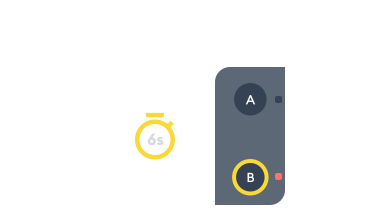

3. The green LED flashes in groups. Briefly press A to cycle the modes, then
   retain the mode matching the wired switch type.

   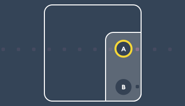 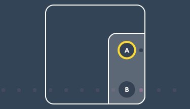

4. Hold B for 3 seconds, until the green LED is steady, to validate the mode.

   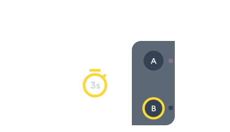 

5. In Home Assistant, press **Start gateway listening**.
6. Hold the selected physical A/B button for 3 seconds until the red LED
   flashes.

   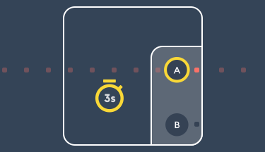 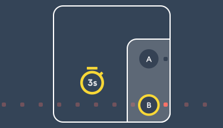

7. Wait while Home Assistant detects the new product.
8. To confirm the selected channel, press the wired wall switch connected to
   that A/B channel. Do not press the TYXIA module button again.

   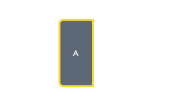 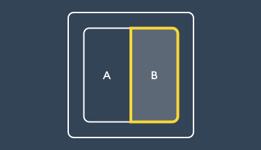

Use **Dissociate this button** to remove A or B independently; the other
channel remains associated.

</details>

<details>
<summary><strong>TYXIA 1410 remote control (C3 and AMG) — Tywell Pro — Button 1 to 4</strong></summary>

1. Check the **Works with Tydom** mark on the rear of the remote. A visually
   identical version without that compatibility mark cannot be associated.

      

2. In Home Assistant, select Button 1, 2, 3 or 4, then press **Start gateway
   listening**.
3. While listening is active, hold the selected remote button for 5 seconds,
   until the red LED flashes. Release it.

   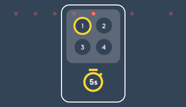 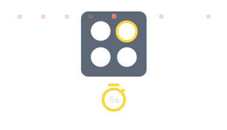 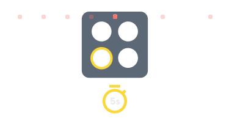 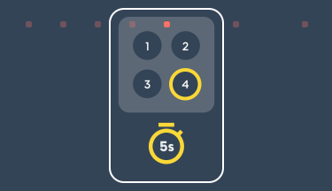

4. Wait for detection in Home Assistant. There is no mobile-app confirmation
   and no second physical press.

   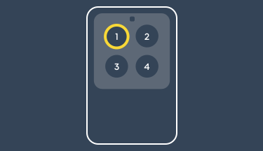 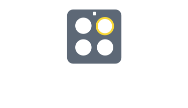 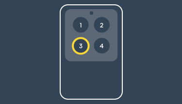 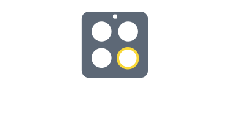

Use **Dissociate this button** for the selected channel only.

</details>

<details>
<summary><strong>TL 2000 remote control — Tywell Pro — Button 1 or 2</strong></summary>

1. Check the **Works with Tydom** mark on the rear and select Button 1 or 2 in
   Home Assistant.

    

2. Hold 1 + 2 for 5 seconds until the LED is orange.

    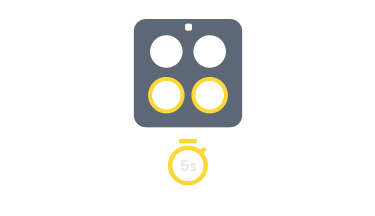

3. Press the selected button once. Continue when the LED flashes in groups of
   four; another press on the selected button changes the group count.

   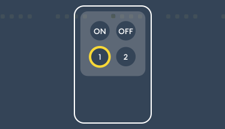 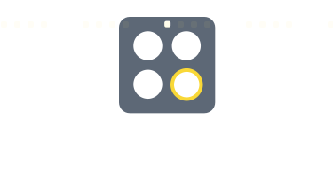

4. If the LED is still flashing, press ON until it becomes green.

   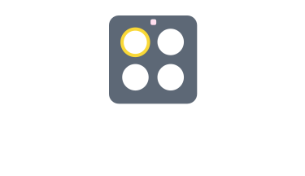 

5. In Home Assistant, press **Start gateway listening**.
6. While listening is active, hold ON + the selected button for 5 seconds,
   until the LED is red.

   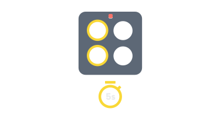 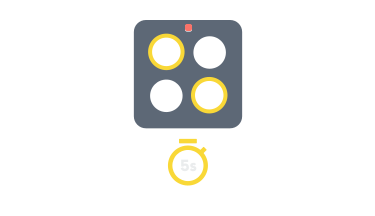

7. Wait for Home Assistant to detect the remote, then press the selected
   button once to confirm the channel.

   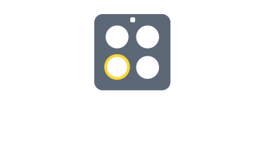 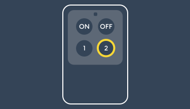

Use **Dissociate this button** for the selected channel only.

</details>

<details>
<summary><strong>TYXIA 4620 dry-contact receiver — Tywell Pro</strong></summary>

1. In Home Assistant, select **Sliding gate** or **Wicket gate**, then hold
   the receiver touch control for 3 seconds.

   

2. When the red LED flashes, the receiver is ready. In Home Assistant, press
   **Start gateway listening** and wait for discovery.

   

The selected usage turns the discovered endpoint into a named gate product,
rather than an unmanaged Produit N. Use **Permanently dissociate device** to
remove it from the gateway and its TYDOM configuration.

</details>

<details>
<summary><strong>TYWATT 5100 — TYDOM 1.0</strong></summary>

1. At the first guide step, press **Start gateway listening** in Home
   Assistant.

   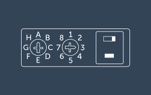

2. Refer to the official installation manual to set the measurement selectors.

   

3. Set the switch to ON. Its LED lights for one second.

   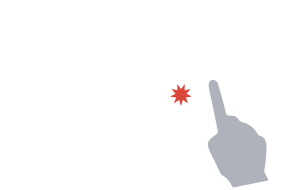

4. Hold the touch control for 3 seconds.

   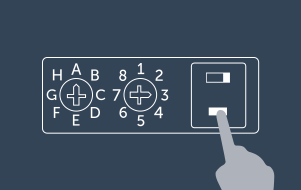

This flow was validated by a contributor on TYDOM 1.0. The gateway-owned
meter configuration is preserved; do not rewrite a discovered meter as a
generic product.

</details>

<details>
<summary><strong>Tysense Sun — Tywell Pro</strong></summary>

1. This product is offered only on Tywell Pro/Home gateways. Open the cover
   and move the internal switch left to ON. At this guide step, press **Start
   gateway listening** in Home Assistant.

   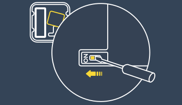

2. Hold the product button for 3 seconds. Its LED lights; wait about
   30 seconds for discovery.

   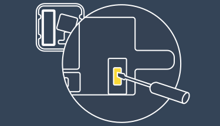

Use **Permanently dissociate device** to remove it. A later association
restores the dedicated sensorSun configuration rather than a generic sensor.

</details>
## Capturing data for unsupported devices

The repository includes a read-only capture tool for documenting devices and
protocol behaviour that the integration does not yet support:

```bash
python3 tools/capture_tydom_data.py \
  --host 192.168.1.100 \
  --mac AABBCCDDEEFF \
  --password '<Tydom gateway password>' \
  --duration 120
```

The tool requests the current configuration, device, area, scenario, group and
moment resources, including `/devices/meta`, `/devices/cmeta`, `/devices/data`,
`/areas/meta`, `/areas/cmeta` and `/areas/data`. It then continues listening for
events while the equipment is operated physically or from the Tydom app.

Each run produces:

- `raw_messages.txt`, containing timestamped and replayable WebSocket frames;
- `parsed_messages.json`, containing normalised URIs, methods or response
  statuses, and decoded payloads.

Passwords, tokens, authorisation headers and email addresses are redacted before
the files are written. Device identifiers, names, topology and state values are
retained because they are needed for protocol analysis, so captures must still
be reviewed before being shared publicly.

For a useful device capture, perform one clearly identifiable action, wait about
ten seconds, perform the reverse action, and record both timestamps. The capture
records responses and events published by the gateway; it cannot necessarily
reveal the exact outbound request sent by another client such as the official
mobile application.

See the [complete capture guide](tools/README_capture.md) for local and remote
connection examples, output analysis, parser validation and security guidance.
The separate [endpoint discovery guide](tools/README_discover_endpoints.md)
describes how to probe available API resources and HTTP methods.

## TYXAL+ remote management

The alarm control panel provides services for the TYXAL+ functions that are
useful in Home Assistant:

- `deltadore_tydom.get_events` returns alarm history and can filter it to alarm,
  activation/deactivation or unacknowledged events;
- `deltadore_tydom.acknowledge_events` acknowledges pending alarm events;
- `deltadore_tydom.get_open_issues` returns the exact products currently
  reported by the alarm central as preventing normal arming;
- `deltadore_tydom.force_arm` explicitly arms a configured Away, Home or Night
  mode when normal arming was refused because of defects;
- `deltadore_tydom.get_alarm_products` lists configured products and zones;
- `deltadore_tydom.enter_alarm_maintenance` unlocks remote configuration and
  puts a disarmed CS8000 into maintenance mode;
- `deltadore_tydom.get_alarm_product_configuration` reads a product's active
  state and zone assignment;
- `deltadore_tydom.configure_alarm_product` enables or disables a product and
  can assign it to another zone;
- `deltadore_tydom.rename_alarm_zone` changes a zone's custom name, or clears
  its label when supplied with an empty name;
- `deltadore_tydom.exit_alarm_maintenance` returns the CS8000 to its normal
  disarmed state and locks remote configuration again.

Use the first service to obtain the product and zone IDs required by the other
services. Product configuration requires the CS8000 to be disarmed and the
TYXAL installer code supplied in each service call. Enter maintenance before
reading or changing product configuration, and always exit maintenance when
finished. The installer code is used only for the request and is redacted from
logs. Product deletion, access codes, telephone settings and siren
configuration are not exposed.

`force_arm` does not replace the normal Home Assistant alarm controls. Use it
only after checking the reported defects and deciding that forced arming is
appropriate.

### Alarm blockers and refused arming

`deltadore_tydom.get_open_issues` asks the alarm central for the products which
currently prevent a **normal** arm operation. The central is the source of
truth: the result is not inferred from the state of Home Assistant contact
sensors. It can therefore report any compatible protected product, including
contacts such as MDO, DO, DOS or MO products when the central provides them.

Call the action from a script, automation, or **Developer tools > Actions**.
Because it returns data, Home Assistant requires a response variable when it is
run from Developer tools:

```yaml
action: deltadore_tydom.get_open_issues
target:
  entity_id: alarm_control_panel.tyxal_alarm
response_variable: open_issues
```

The response variable is a list of products. Each entry contains the metadata
supplied by the central, such as `id`, `name`, `type_short`, `type_long`,
`zone`, `defects` and `error` when available. The latest result is also stored
on the alarm entity as `open_issue_count` and `open_issues`, so it can be used
in dashboards and templates without keeping a separate helper.

After a refused normal arm operation, the integration automatically requests
the same information. Some CS8000 firmware records the refusal event shortly
after its command response, so the integration waits briefly and retries once
if the central has not yet made the blocker record available. A successful
normal arm clears the stored list.

This is not continuous contact monitoring: opening or closing a contact does
not by itself refresh `open_issues`. Use the action before offering a force-arm
choice, after a refusal, or from an automation triggered by contact entities
which are available in your installation.

The TYXAL alarm device also provides an **Acknowledge events** button for
convenient dashboard use without requiring a service call or automation.

When TYDOM reports the actor for an alarm transition, the alarm entity exposes
`changed_by` with the user-code or product name and `changed_by_type` with
either `access_code` or `product`. These attributes describe the latest
reported arm or disarm transition.

## Known limitations

- Dry-contact TYXIA 4620 gate and garage configurations provide an impulse
  command but no position or direction feedback. Home Assistant therefore
  exposes a stateless toggle button and cannot determine whether the next pulse
  will open, stop or close the motor. A gate or garage is exposed as a cover
  only when its endpoint advertises readable `level` feedback; a writable
  command alone is not enough to establish its actual position.
- The native Tywell shutter cover replays the `TWC_UP`, `TWC_DOWN` and
  `TWC_STOP` scenarios created by TYDOM. Its shutter membership must therefore
  be configured in the official application, and aggregate position is only
  available when all configured targets provide suitable feedback.
- Battery-powered and radio devices report according to their own schedule.
  Refreshing or polling the gateway cannot force a sleeping device to transmit
  a newer value.
- An exact model name is displayed only when TYDOM provides reliable product or
  tutorial metadata. Other compatible devices retain a generic Delta Dore
  model name rather than being guessed from broad capabilities.
- The capture tool records messages returned or published by the gateway. It
  cannot always reveal the exact outbound request sent by the official mobile
  application.
- TYXAL remote management exposes the safe, confirmed operations documented
  above. Product deletion, access codes, telephone settings and siren
  configuration are not supported.

## Security

Do not report suspected vulnerabilities in a public issue. Read the
[security policy](SECURITY.md) and use the private reporting process described
there.

## Contributing

If you would like to contribute, please read the [contribution guidelines](CONTRIBUTING.md).

***

[buymecoffee]: https://www.buymeacoffee.com/cyrilp
[buymecoffeebadge]: https://img.shields.io/badge/buy%20me%20a%20coffee-donate-yellow.svg?style=for-the-badge
[license-shield]: https://img.shields.io/github/license/CyrilP/hass-deltadore-tydom-component.svg?style=for-the-badge
